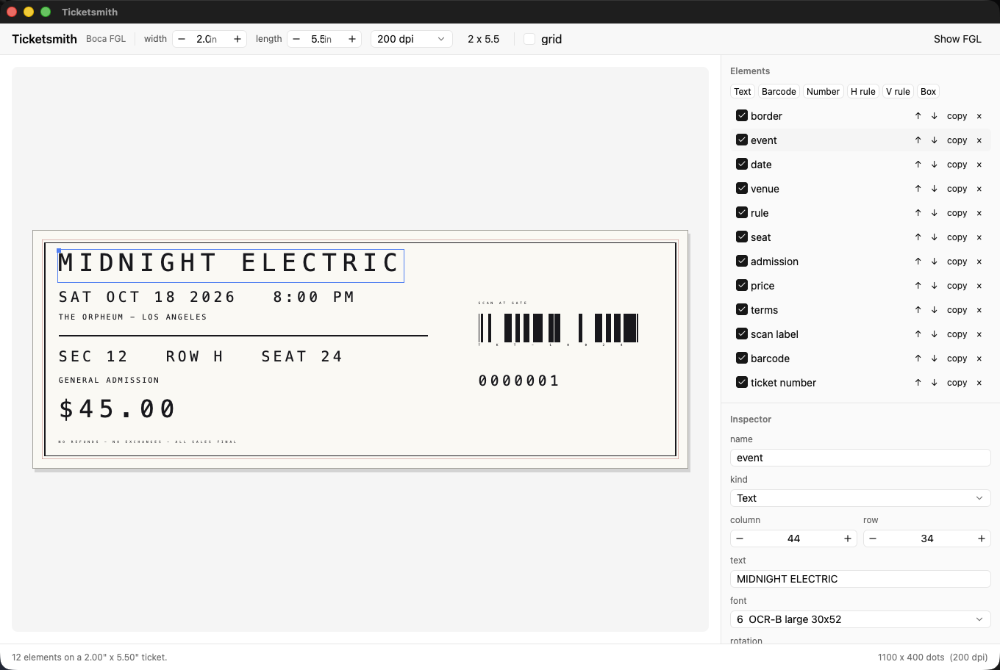

# Ticketsmith

A ticket designer for Boca Systems printers, in Rust on GPUI.

One window. The ticket on the left, everything that changes it on the right.
Drag things around, set a quantity, hit print. What leaves the app is plain
[FGL](https://www.bocasystems.com/documents/fgl46_rev16_1.pdf) — Boca's
"Friendly Ghost Language" — so the source panel shows byte for byte what the
printer receives.



## Download

[**Ticketsmith.dmg**](https://github.com/wes/ticketsmith/releases/latest/download/Ticketsmith.dmg)
— the latest release for macOS 12 or later, Apple silicon and Intel in one app,
signed and notarized. Older versions are on the
[releases page](https://github.com/wes/ticketsmith/releases).

## Running it

```
cargo run              # launch
cargo test             # 84 tests
scripts/bundle.sh      # build target/Ticketsmith.app
```

The first build takes a few minutes because it compiles GPUI. After that it is
seconds. Releases are cut with `scripts/release.sh`; see
[RELEASING.md](RELEASING.md).

## What it does

**Stock.** Defaults to the standard 2" x 5.5" ticket at 200 dpi. Both dimensions
are free, and the head density can be 200, 300 or 600 dpi. The status bar shows
the resulting dot grid, because FGL positions everything in dots.

**Layout.** Add text, barcodes, the printer's own ticket counter, rules and
boxes. Drag them on the preview, or nudge with the arrow keys — shift for a
coarser step, escape to deselect, cmd-backspace to delete. Everything is measured the
way the printer measures it: text is laid out one font box-advance per character,
so what you see is where the dots land.

The preview draws the ticket in FGL's own orientation, the 5.5" feed axis running
left to right. That is both how a Boca ticket is held and how `<RC row,column>`
numbers read, so the preview and the inspector never disagree.

**Barcodes.** Code 128, Code 39, Interleaved 2 of 5, Codabar, UPC-A, EAN-13 and
QR, with orientation, bar height, narrow-bar width, the 3:1 ratio where the
symbology allows it, and the human-readable interpretation. Data is validated per
symbology as you type, and UPC/EAN check digits are worked out for you.

**Printing.** Set the quantity and the job goes out as one stream with an `<RE>`
repeat, which is how the printer runs at full speed. Turn on numbering and the
run comes out sequentially numbered from the printer's own counter.

## Getting it to the printer

Four routes, covering both connections these printers ship with:

| Target | What it is |
| --- | --- |
| **Ethernet** | Raw TCP to port 9100. Every Boca ethernet and WiFi interface listens there. |
| **USB device** | A device node. This is USB when the printer's port is in serial mode (`<usbs>`): `/dev/cu.usbmodem*` on macOS, `/dev/ttyACM0` or `/dev/usb/lp0` on Linux. |
| **Print queue** | `lp -d QUEUE -o raw`. This is USB when the printer is left in its default printer mode (`<usbp>`) and installed as a CUPS queue. macOS and Linux. |
| **Save .fgl** | Write the job to disk. Test the whole pipeline without burning stock. |

Sending runs on the background executor, so a printer that is switched off waits
out its connect timeout without freezing the window.

## Layout of the code

The core is plain Rust with no UI dependency and carries most of the tests.

| File | |
| --- | --- |
| `src/fgl.rs` | FGL command emission: the resident fonts and their dot metrics, rotation, text, rules, boxes, the ticket counter, print and repeat commands. |
| `src/barcode.rs` | Symbology validation, FGL emission, GTIN check digits, and bar/space modules for the preview. |
| `src/ticket.rs` | The document: stock size, elements, element geometry, hit testing, and the whole-job emitter. |
| `src/transport.rs` | The four ways out. |
| `src/preview.rs` | Projection from printer dots to window pixels, and all the painting. |
| `src/app.rs` | The GPUI window: toolbar, preview interaction, inspector, print panel. |

## On the UI stack

`gpui-kit` is one dependency that pulls in GPUI (published as `gpui-pre`) plus
[gpui-component](https://github.com/longbridge/gpui-kit), a component library
built on top of it. GPUI itself has no text input, dropdown or checkbox — Zed
builds its own — and this app is mostly a form, so the component library is doing
real work here.

## Two things the preview does not do

**Rotated glyphs.** GPUI's paint API can rotate SVG paths but not quads or shaped
text. A rotated text element is drawn with upright glyphs stepped along the true
rotated advance: the footprint is exact and the characters stay legible, but they
are not turned the way the printer turns them. A small tick marks the direction
so the difference is visible.

**Two symbologies' bar patterns.** Bars are the real encoding for Code 39,
Interleaved 2 of 5, UPC-A and EAN-13. For Code 128 and Codabar the preview draws
the exact footprint with representative bars, and the inspector says so. QR shows
the exact symbol size with finder patterns.

That second one is less a shortcut than a description of where the work happens:
the printer encodes every symbol in firmware, including Code 128 code-set
switching and check digits. The app sends a payload and delimiters. Sizing and
placement are what a print preview is for, and those are exact.

## Reference

Boca Systems FGL46/FGL26 Programming Guide, revision 16.1, 20 June 2024. Command
syntax, font metrics and the barcode supplements all come from there.

## License

[MIT](LICENSE).
